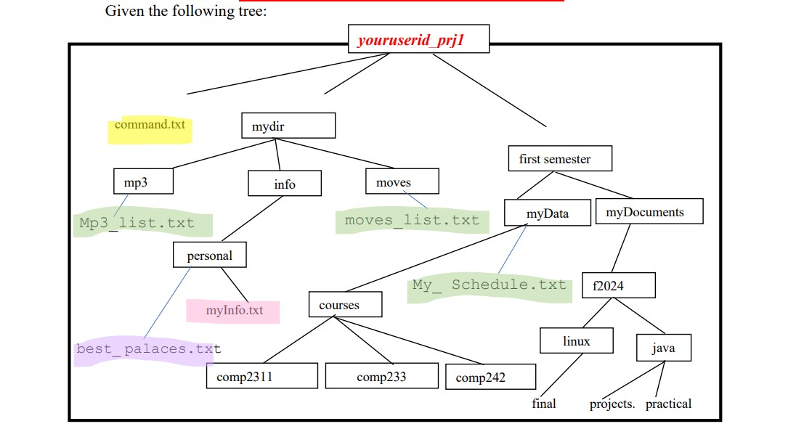

# Linux Directory and File System Project

# Objective
Create a structured directory and file system using command-line operations and implement specific file manipulations using macros and linking.

# Requirements
Directory Creation:

Set up a directory named youruserid_prj1 under your home directory.
Inside this directory, create a file command.txt containing all command explanations.
File Creation:

Create myInfo.txt and include your personal information.
Edit best_palaces.txt with descriptions of five places visited in Palestine.
Macro Implementation:

Macro H: Deletes the last four words from the last line.
Macro W: Copies and pastes the last two lines above the 8th line.
Link Creation:

Create a link linkmyInfo in myDocuments to myInfo.txt.
Create a link link_courses in f2024 to the courses directory.
Command Execution:

Perform specific text manipulations using vi commands.
List files in /etc starting with 'h' or 'j', followed by a vowel.
Copy files from java directory to comp2311.
Create and attempt to delete a file in comp242 directory.
Change permissions for directories and files using specific modes.

# Directory Tree:

